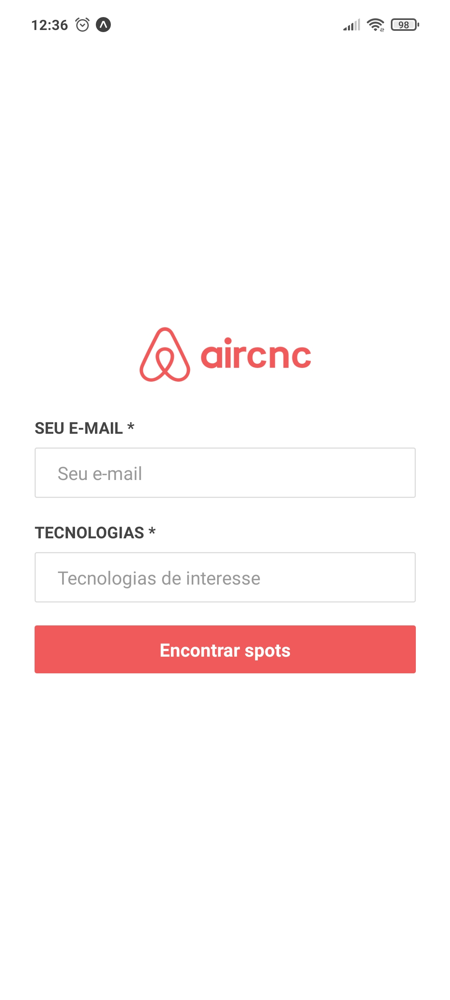
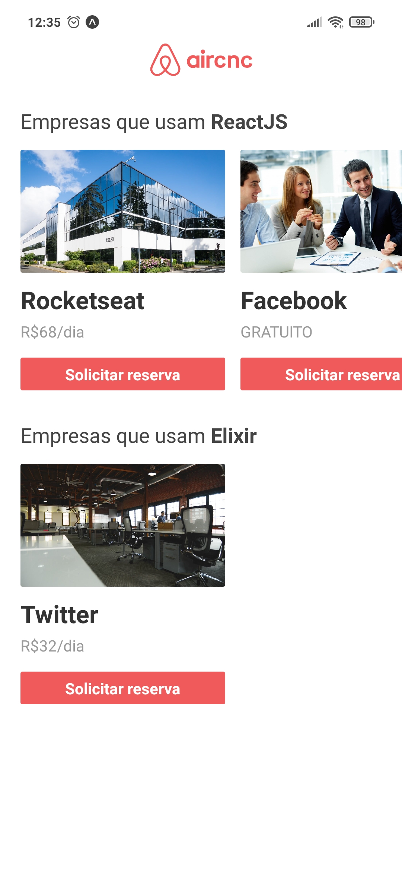
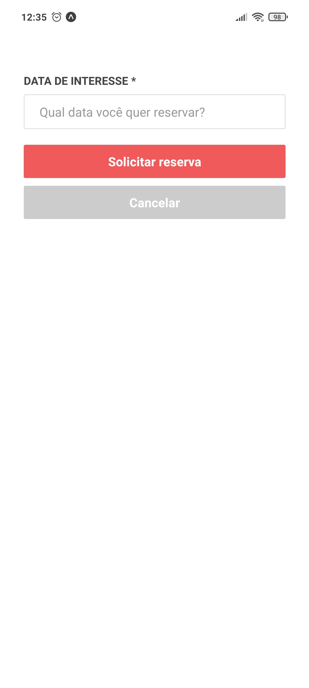
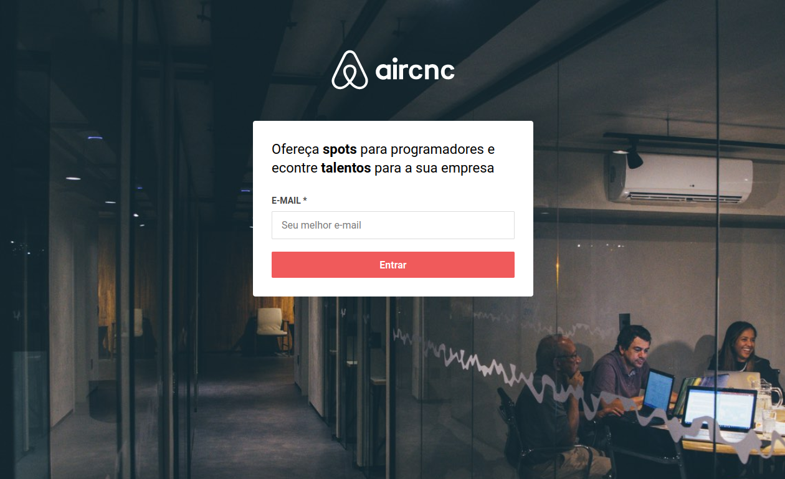
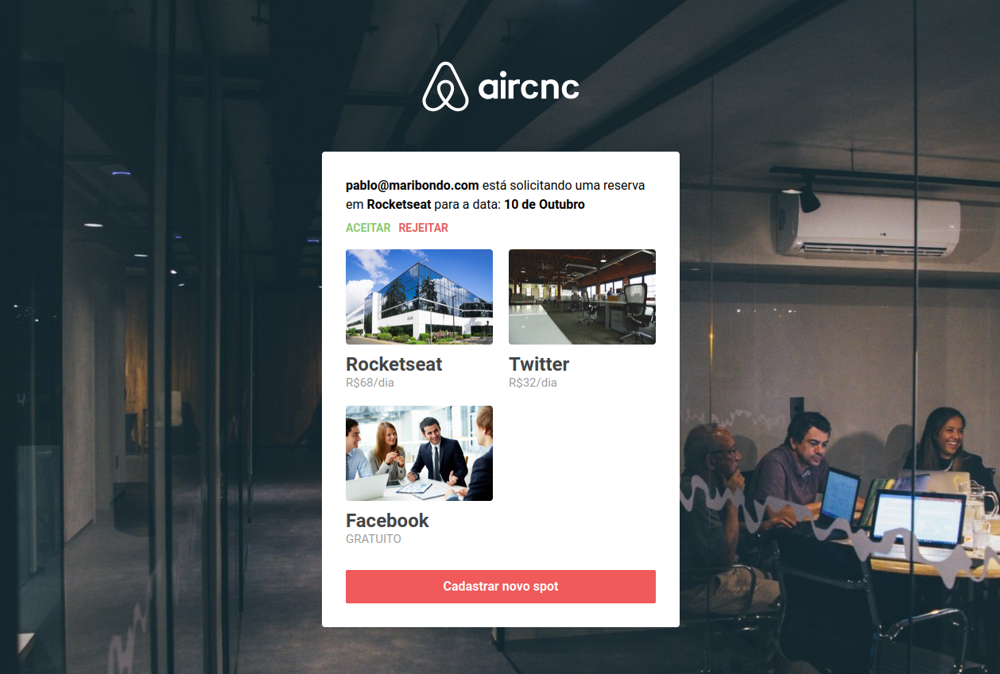
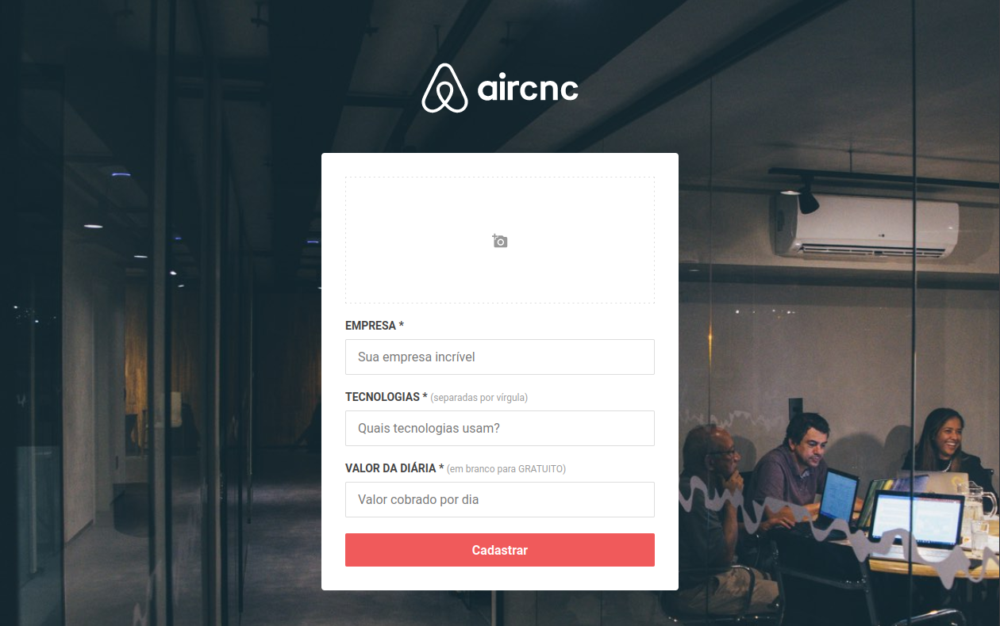

<h1 align="center">
  
</h1>

<h4 align="center">
  🚀 Semana OmniStack 9.0
</h4>

## :book: Projeto

Projeto desenvolvido com base nas aulas do evento **Semana OmniStack 9.0**, oferecido pela [Rocketseat](https://www.rocketseat.com.br).
A ideia do projeto é reproduzir de forma simples a platarforma Airbnb (bed & breakfast), mas para devs que desejam passar alguns dias em empresas de tecnologias.
Assim surgiu o Aircnc (coffee & code).

## :hammer_and_wrench: Tecnologias

As seguintes tecnologias foram utilizadas no desenvolvimento do projeto:

- [Node.js](https://nodejs.org/en/)
- [Express](https://expressjs.com/)
- [Socket.io](https://socket.io/)
- [MongoDB](https://www.mongodb.com/)
- [Mongoose](https://mongoosejs.com/)
- [Multer](https://github.com/expressjs/multer)
- [ReactJS](https://reactjs.org/)
- [Axios](https://github.com/axios/axios)
- [React Native](http://facebook.github.io/react-native/)
- [Expo](https://expo.io/)

## :camera_flash: Screenshots

### :iphone: Mobile:

    
&nbsp; &nbsp; &nbsp; &nbsp;
    
 &nbsp; &nbsp; &nbsp; &nbsp;
  

### :computer: Web:

 
&nbsp; &nbsp; &nbsp; &nbsp;
 

 

